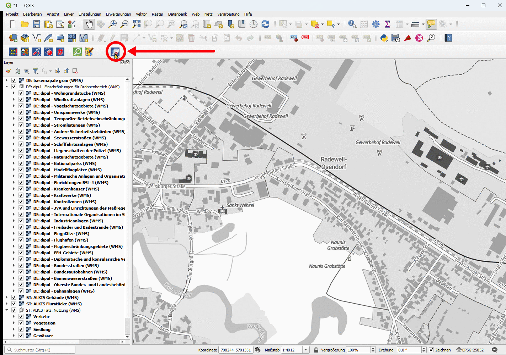

# QGIS-Plugin: Layer Multiply Toggle

Schaltet der Mischmodus für für alle oder ausgewählte Ebenen und Gruppen auf „Multiplizieren“  um.

Eine genaue Beschreibung und FAQs  finden Sie unter https://geoobserver.de/qgis-plugin-layermultiplytoggle/

Eine Haftung für die Richtigkeit aller Funktionen des Plugins kann trotz sorgfältiger Prüfung nicht übernommen werden. Das gilt auch für eventuelle Schäden oder Konsequenzen, die durch die direkte oder indirekte Nutzung der angebotenen Inhalte entstehen.

------------------------

Switches the blending mode for all or selected layers and groups to “Multiply.”

A detailed description and FAQs can be found at https://geoobserver.de/qgis-plugin-layermultiplytoggle/

Despite careful testing, we cannot accept any liability for the accuracy of all functions of the plugin. This also applies to any damage or consequences resulting from the direct or indirect use of the content provided.

