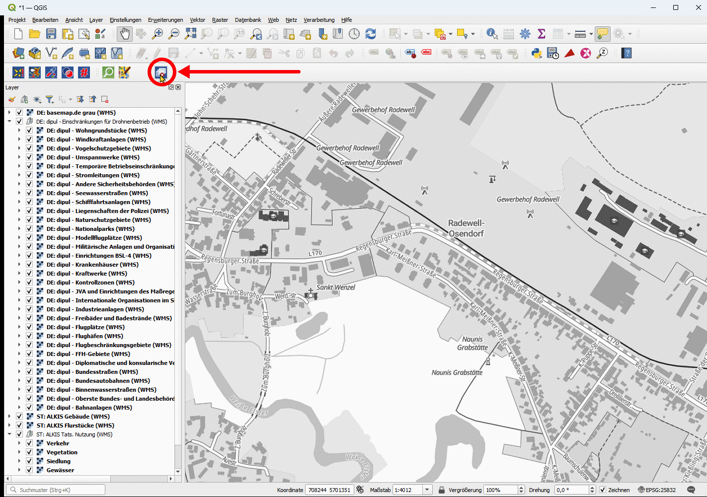

# Layer Multiply Toggle

**DE** — Schaltet mit einem Klick den Mischmodus **Multiplizieren** für **alle** oder nur die **ausgewählten** Ebenen und Gruppen ein und wieder aus.

**EN** — Toggles the **Multiply** blend mode for **all** or only the **selected** layers and groups with a single click.

---

## Inhalt / Contents

- [Deutsch](#deutsch)
  - [Wozu dient das Plugin?](#wozu-dient-das-plugin)
  - [Funktionen](#funktionen)
  - [Installation](#installation)
  - [Verwendung](#verwendung)
  - [Was Multiplizieren bewirkt](#was-multiplizieren-bewirkt)
  - [Verhalten und Persistenz](#verhalten-und-persistenz)
  - [Kompatibilität](#kompatibilität)
- [English](#english)
  - [What is it for?](#what-is-it-for)
  - [Features](#features)
  - [Installation](#installation-1)
  - [Usage](#usage)
  - [What Multiply does](#what-multiply-does)
  - [Behaviour and persistence](#behaviour-and-persistence)
  - [Compatibility](#compatibility)
- [Letzte Änderungen / Changelog](#letzte-änderungen--changelog)
- [Lizenz und Haftung / License and disclaimer](#lizenz-und-haftung--license-and-disclaimer)
- [Autor / Author](#autor--author)

---

# Deutsch

## Wozu dient das Plugin?

In der Kartografie sollen sich Ebenen oft gegenseitig durchscheinen lassen, statt sich zu verdecken: ein Schummerungs- oder Reliefraster über der Landnutzung, Schraffuren über einem Luftbild, ALKIS-Linien über einer Hintergrundkarte. Der dafür passende Mischmodus liegt in QGIS tief in den *Layereigenschaften → Symbolisierung → Layer-Rendering → Mischmodus* – und muss für jede Ebene einzeln gesetzt werden.

**Layer Multiply Toggle** macht daraus einen einzigen Klick in der Werkzeugleiste: Der Mischmodus **Multiplizieren** wird auf einen Schlag für alle oder die ausgewählten Ebenen/Gruppen gesetzt und beim erneuten Klick wieder zurückgenommen – ohne die ursprünglichen Einstellungen zu verlieren.

## Funktionen

- Ein-Klick-Umschalter in der Werkzeugleiste `geoObserverTools`.
- Wirkt auf **alle** Ebenen oder nur auf die im Layerbaum **ausgewählten** Ebenen und Gruppen (rekursiv inkl. Untergruppen).
- Setzt den Mischmodus **Multiplizieren** – den in der Praxis nützlichsten Modus, um Ebenen durchscheinen zu lassen.
- **Anklickbares Multiply-Icon je Layer** im Layerbaum: schaltet Multiplizieren nur für diesen Layer ein/aus; das Icon zeigt den Zustand.
- **Ursprüngliche Mischmodi werden gesichert** und beim Ausschalten exakt wiederhergestellt – kein Überschreiben bewusst gesetzter Modi.
- **Projektbezogene Persistenz**: Der Ein/Aus-Zustand übersteht Speichern, Schließen und erneutes Öffnen des Projekts.
- **Rechtsklick auf den Werkzeugknopf = Menü**: *Show layer icons* (ein-/ausschaltbar, global gespeichert) blendet die Icons im Layerbaum bei Bedarf aus, ohne die Funktion zu beeinflussen; *Reset* stellt alle ursprünglichen Mischmodi wieder her, entfernt alle Plugin-Icons aus dem Layerbaum, löscht den gespeicherten Status und schaltet den Toggle auf „aus".
- Kompatibel mit dem Plugin **Plugin Reloader** (sauberes Neuladen).
- Rückmeldungen über die QGIS-Meldungsleiste, Protokollierung im QGIS-Logfenster (Reiter `LayerMultiplyToggle`).

## Installation

1. QGIS öffnen: *Erweiterungen → Erweiterungen verwalten und installieren*.
2. Nach „Layer Multiply Toggle" suchen und installieren.

Alternativ manuell: den Plugin-Ordner nach `…/QGIS3/profiles/default/python/plugins/LayerMultiplyToggle` kopieren und das Plugin in der Erweiterungsverwaltung aktivieren.

## Verwendung

1. Optional im Layerbaum die gewünschten Ebenen/Gruppen markieren. Ohne Auswahl wirkt das Plugin auf alle Ebenen.
2. In der Werkzeugleiste auf den **Layer-Multiply-Knopf** klicken: Multiplizieren wird gesetzt (Knopf „an").
3. Erneuter Klick auf den Knopf stellt die ursprünglichen Mischmodi wieder her (Knopf „aus").
4. Alternativ pro Layer: im Layerbaum auf das **Multiply-Icon** rechts neben dem Layernamen klicken — schaltet Multiplizieren nur für diesen Layer um (das Icon zeigt an/aus).
5. **Rechtsklick auf den Werkzeugknopf** öffnet ein kleines Menü: *Show layer icons* schaltet die Anzeige der Layerbaum-Icons ein/aus (global gespeichert, beeinflusst die Funktion nicht); *Reset* setzt alles zurück (Original-Mischmodi wiederhergestellt, alle Layerbaum-Icons entfernt, Status gelöscht, Toggle „aus").

## Was Multiplizieren bewirkt

Der Mischmodus **Multiplizieren** multipliziert die Farben einer Ebene mit denen der darunterliegenden – das Ergebnis ist stets **dunkler**. Weiß ist dabei wirkungslos (neutral), Schwarz bleibt schwarz. Praktisch legt sich die obere Ebene wie eine Lasur über die untere, statt sie zu verdecken.

| Bereich der oberen Ebene | Wirkung auf den Untergrund |
|--------------------------|----------------------------|
| **Helle Bereiche** (Richtung Weiß) | bleiben weitgehend durchsichtig – der Untergrund scheint durch |
| **Dunkle Bereiche** (Richtung Schwarz) | dunkeln den Untergrund sichtbar ab |

**Typischer Einsatz:** Schummerung/Relief über Landnutzung legen, Schraffuren oder ALKIS-Linien über ein Luftbild – der Untergrund bleibt lesbar.

> Hinweis: Andere Mischmodi (Negativ multiplizieren, Ineinanderkopieren, Abdunkeln, Aufhellen) wirken stark von Daten und Stapelreihenfolge abhängig und blieben im Test oft ohne sichtbaren Unterschied. Das Plugin beschränkt sich daher bewusst auf **Multiplizieren**; alle übrigen Modi lassen sich bei Bedarf weiterhin manuell über die Layereigenschaften setzen.

## Verhalten und Persistenz

- Beim Einschalten merkt sich das Plugin pro Ebene den **vorherigen** Mischmodus (nur beim ersten Mal je Ebene). Beim Ausschalten wird genau dieser Zustand wiederhergestellt – unabhängig von der aktuellen Auswahl.
- Der Ein/Aus-Zustand und die gesicherten Originalwerte werden **im QGIS-Projekt** gespeichert. Nach erneutem Öffnen spiegelt der Knopf den gespeicherten Zustand wider, ohne Multiplizieren erneut anzuwenden (die Ebenen tragen den Modus bereits aus der Projektdatei).

## Kompatibilität

- Minimum **QGIS 3.0**; getestet auf QGIS 3.x (Qt5) und QGIS 4.x (Qt6).

---

# English

## What is it for?

In cartography, layers should often show through one another instead of hiding each other: a hillshade or relief raster over land use, hatching over an aerial image, cadastral lines over a basemap. The blend mode for this lives deep inside *Layer Properties → Symbology → Layer Rendering → Blending mode* in QGIS, and has to be set for each layer individually.

**Layer Multiply Toggle** turns this into a single toolbar click: the **Multiply** blend mode is applied at once to all or the selected layers/groups, and removed again on the next click, without losing the original settings.

## Features

- One-click toggle in the `geoObserverTools` toolbar.
- Acts on **all** layers, or only the layers and groups **selected** in the layer tree (recursively, including subgroups).
- Sets the **Multiply** blend mode – the most useful mode in practice for letting layers show through one another.
- **Per-layer toggle in the layer tree**: a clickable Multiply icon next to each layer turns Multiply on/off for that layer; the icon reflects the state.
- **Original blend modes are captured** and restored exactly when toggling off, so deliberately set modes are not overwritten.
- **Per-project persistence**: the on/off state survives saving, closing and reopening the project.
- **Right-click the toolbar button = menu**: *Show layer icons* (toggle, stored globally) hides the layer-tree icons on demand without affecting the function; *Reset* restores every layer's original blend mode, removes all plugin icons from the layer tree, clears the stored state and switches the toggle off.
- Compatible with the **Plugin Reloader** plugin (clean reload).
- Feedback via the QGIS message bar, logging in the QGIS log panel (tab `LayerMultiplyToggle`).

## Installation

1. In QGIS: *Plugins → Manage and Install Plugins*.
2. Search for "Layer Multiply Toggle" and install it.

Or manually: copy the plugin folder into `…/QGIS3/profiles/default/python/plugins/LayerMultiplyToggle` and enable the plugin in the Plugin Manager.

## Usage

1. Optionally select the desired layers/groups in the layer tree. With no selection, the plugin acts on all layers.
2. Click the **Layer Multiply button** in the toolbar: Multiply is applied (button "on").
3. Click the button again to restore the original blend modes (button "off").
4. Alternatively, per layer: click the **Multiply icon** next to a layer name in the layer tree to toggle Multiply for that single layer (the icon shows on/off).
5. **Right-click the toolbar button** opens a small menu: *Show layer icons* toggles the display of the layer-tree icons (stored globally, does not affect the function); *Reset* undoes everything (original blend modes restored, all layer-tree icons removed, stored state cleared, toggle off).

## What Multiply does

The **Multiply** blend mode multiplies a layer's colours with those beneath it – the result is always **darker**. White is neutral (no effect), black stays black. In practice the upper layer acts like a glaze over the lower one instead of hiding it.

| Area of the upper layer | Effect on the background |
|-------------------------|--------------------------|
| **Light areas** (towards white) | stay largely transparent – the background shows through |
| **Dark areas** (towards black) | visibly darken the background |

**Typical use:** place hillshade/relief over land use, hatching or cadastral lines over an aerial image while keeping the background readable.

> Note: other blend modes (Screen, Overlay, Darken, Lighten) depend heavily on the data and stacking order and often showed no visible difference in testing. The plugin therefore deliberately focuses on **Multiply**; all other modes remain available manually via the layer properties.

## Behaviour and persistence

- On enable, the plugin remembers each layer's **previous** blend mode (only the first time per layer). On disable it restores exactly that state, regardless of the current selection.
- The on/off state and the captured originals are stored **in the QGIS project**. After reopening, the button mirrors the stored state without re-applying Multiply (the layers already carry it from the project file).

## Compatibility

- Minimum **QGIS 3.0**; tested on QGIS 3.x (Qt5) and QGIS 4.x (Qt6).

---

## Letzte Änderungen / Changelog

### v0.4 (26.05.2026)
- **DE:** Sicherung und exakte Wiederherstellung der ursprünglichen Mischmodi beim Ausschalten. Projektbezogene Persistenz des Ein/Aus-Zustands. Anklickbares Multiply-Icon je Layer im Layerbaum (Multiplizieren pro Layer an/aus). Rechtsklick auf den Werkzeugknopf für vollständigen Reset. Werkzeugknopf als QAction neu umgesetzt, Rückmeldung über die Meldungsleiste. Kompatibilität mit dem Plugin Reloader. Bewusste Beschränkung auf den Modus **Multiplizieren**. Robuster Indikator-Lebenszyklus (keine Leaks/Waisen-Icons, Plugin-Reloader-sicher), gehärtetes Einlesen des projektbezogenen Status. Fehlerbehebungen (Werkzeugleisten-Leak beim Entladen, wirkungslose Gruppen-Eigenschaft entfernt).
- **EN:** Captures and exactly restores the original blend modes on toggling off. Per-project persistence of the on/off state. Per-layer Multiply toggle in the layer tree via a clickable indicator icon. Right-click the toolbar button for a full reset. Toolbar button reworked as a QAction, feedback via the message bar. Plugin Reloader compatibility. Deliberately limited to the **Multiply** mode. Robust indicator lifecycle (no leaks or orphan icons, Plugin-Reloader-safe), hardened reading of per-project state. Bug fixes (toolbar leak on unload, removed ineffective group property).

### v0.2 (24.02.2026)
- **DE:** Kleinere Korrekturen. — **EN:** Minor corrections.

### v0.1 (23.02.2026)
- **DE:** Erstveröffentlichung. — **EN:** Initial release.

---

## Lizenz und Haftung / License and disclaimer

**DE** — Lizenziert unter der [GNU General Public License v2](./LICENSE). Eine Haftung für die Richtigkeit aller Funktionen des Plugins kann trotz sorgfältiger Prüfung nicht übernommen werden. Das gilt auch für eventuelle Schäden oder Konsequenzen, die durch die direkte oder indirekte Nutzung der angebotenen Inhalte entstehen.

**EN** — Licensed under the [GNU General Public License v2](./LICENSE). Despite careful testing, no liability can be accepted for the accuracy of all functions of the plugin. This also applies to any damage or consequences resulting from the direct or indirect use of the content provided.

---

## Autor / Author

**Mike Elstermann** (#geoObserver)

- Beschreibung und FAQ / Description and FAQ: <https://geoobserver.de/qgis-plugin-layermultiplytoggle/>
- Repository: <https://github.com/geoObserver/LayerMultiplyToggle/>
- Issues: <https://github.com/geoObserver/LayerMultiplyToggle/issues/>
